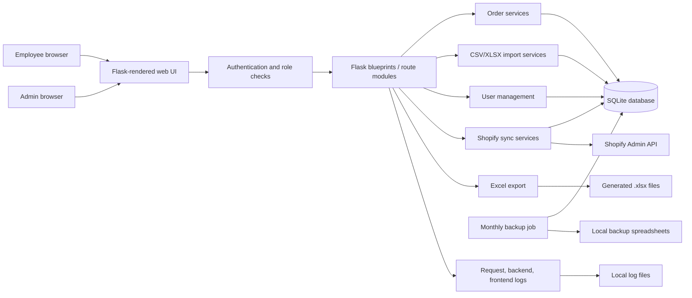
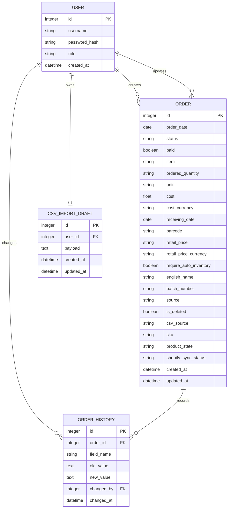
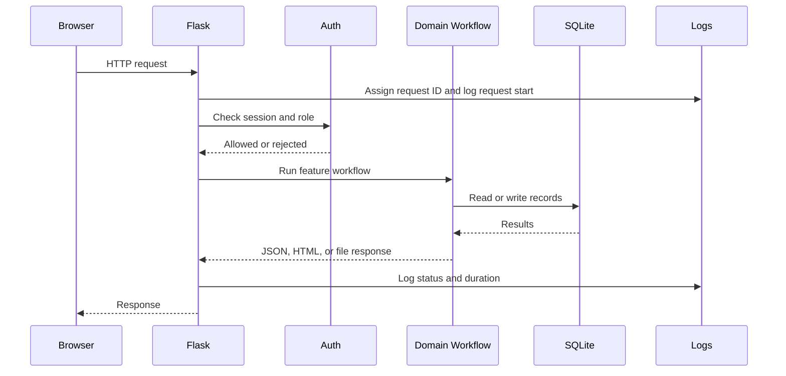
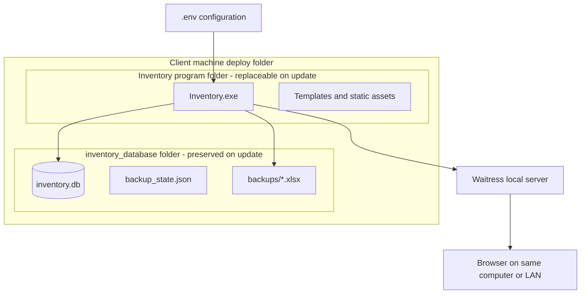
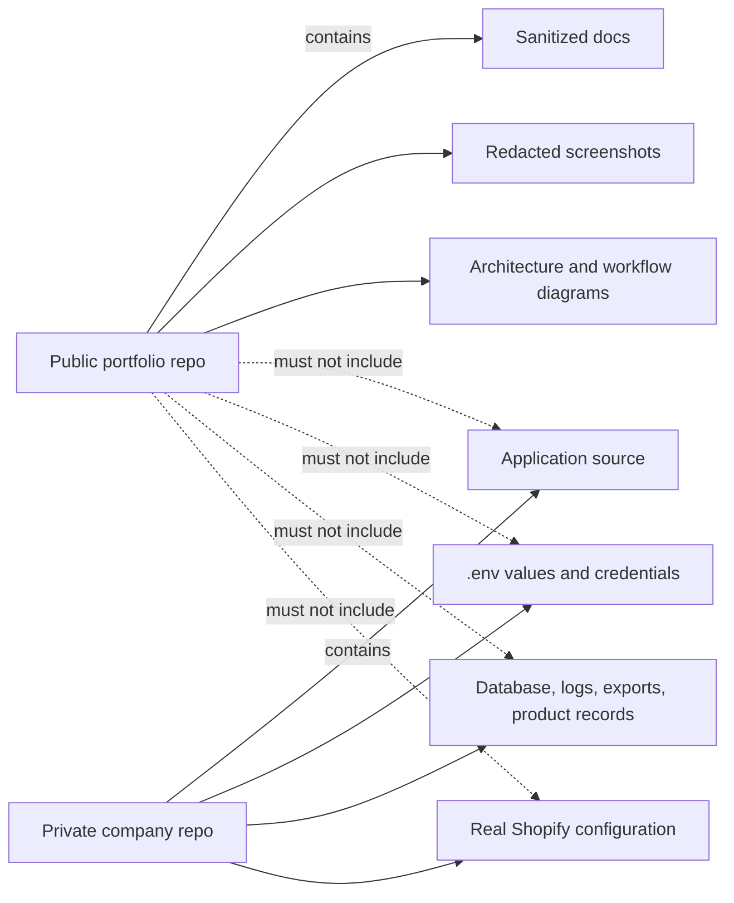

# Architecture

This document explains the system at a high level without exposing private source code.

## System Overview

## Application Layers

| Layer | Responsibility |
| --- | --- |
| Browser UI | Tables, forms, filters, preview editing, admin screens, and user feedback. |
| Flask app | Routing, session handling, role checks, request logging, error handling, and page rendering. |
| Domain workflows | Order CRUD, spreadsheet import, soft delete, export, backups, and Shopify sync. |
| Persistence | SQLite database through SQLAlchemy models. |
| Integration | Shopify API calls for product and inventory synchronization. |
| Packaging | Waitress server plus PyInstaller distribution for Windows deployment. |

## Main Modules

The private source is organized around feature modules:

| Area | Purpose |
| --- | --- |
| App factory | Creates the Flask app, configures logging, registers routes, initializes the database, runs migrations, and starts scheduled backup checks. |
| Auth | Login, logout, default admin seeding, and admin-only route protection. |
| Orders | Main order table, filters, add/edit/delete/restore flows, similar-product lookup, bulk delete, and export. |
| CSV/XLSX import | File decoding, column matching, row validation, preview refresh, draft saving, and import commit. |
| Shopify | Worklists, connection status, payload preparation, product sync, failed-sync handling, and manual mark-as-synced flow. |
| Users | Admin user creation, listing, role assignment, and deletion. |
| Validators | Shared parsing and validation for dates, quantities, money, currency, and booleans. |
| Backup | Monthly backup decision logic and spreadsheet generation trigger. |
| Logging | Backend, frontend, and server log formatting. |

## Data Model

Sensitive fields such as real product names, barcodes, supplier notes, pricing, production Shopify IDs, and credentials are not included in this public display.

## Request Flow

## Packaged Deployment Model

The important design choice is that runtime data lives outside the replaceable program folder. Updating the app means replacing the program files while leaving the database and backups untouched.

## Security Boundaries

