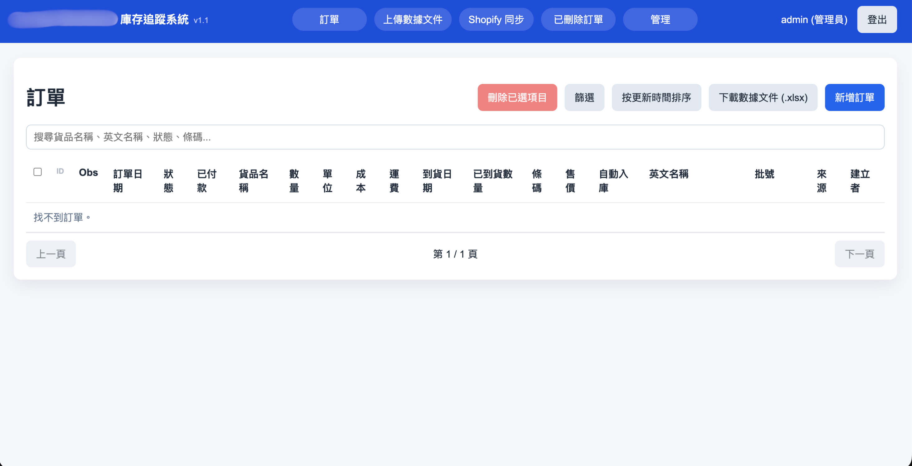
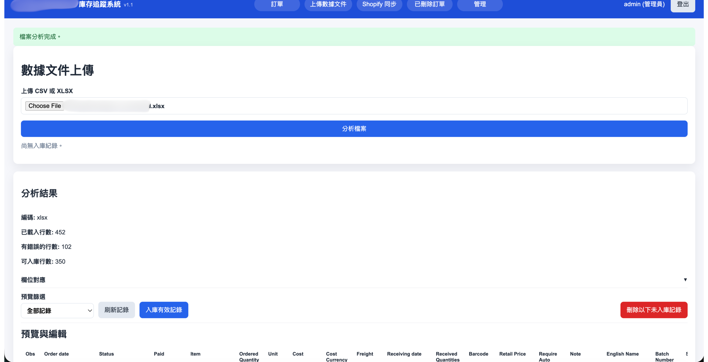
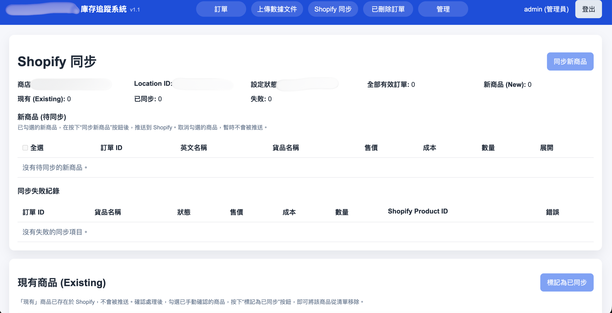
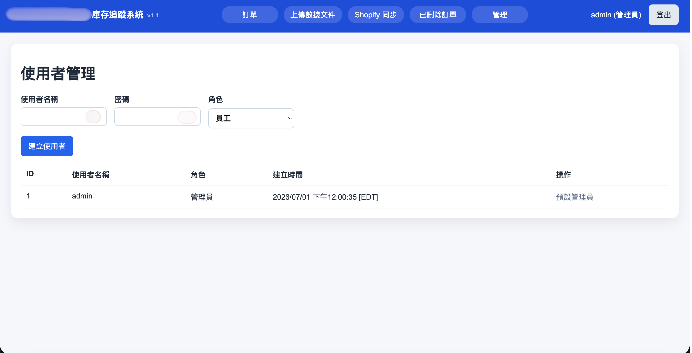

# Inventory & Order Management App

A browser-based inventory and order tracking system for small teams that need one shared place to manage purchase/order records, import spreadsheet data, track edit history, and prepare products for Shopify inventory workflows.

This public README is intentionally sanitized for demonstration purposes. It does not include real company names, production credentials, private URLs, customer data, supplier data, barcodes, order values, or screenshots containing sensitive business information.

## Preview

The screenshots below show the administrator workflow with all company-specific values redacted or replaced. The live app UI is Chinese-language, while this README describes the project in English for a public GitHub audience.

### Orders Dashboard



The main order table supports search, filters, sorting, selection, bulk deletion, spreadsheet export, and new order creation.

### Deleted Orders & Data Sources


Deleted orders are kept in a recovery area before permanent cleanup. The same screen also summarizes imported data file sources.

### CSV / Excel Import Review



Uploaded CSV/XLSX files are analyzed before import, with row counts, validation issue counts, column mapping, preview filters, and editable rows.

### Shopify Sync Queue



The Shopify sync screen separates new products, existing products, synced totals, failed sync records, and store/location configuration status.

### Admin User Management



Admins can create users, assign roles, and review existing accounts from a dedicated management screen.

## What It Does

- Centralizes order and inventory records in a shared web interface.
- Supports role-based access for administrators and employees.
- Lets users search, filter, sort, add, edit, delete, restore, and export order records.
- Imports order data from CSV or Excel files with preview, validation, editable rows, and import history.
- Tracks record-level change history so admins can see what changed, when it changed, and who changed it.
- Provides a soft-delete workflow with a deleted-orders screen for restore or permanent cleanup.
- Separates new Shopify-ready products from existing products that need manual review.
- Runs monthly local backups so the team has recent spreadsheet exports available.
- Can be packaged as a Windows desktop-style distribution using PyInstaller.

## Tech Stack

- Python
- Flask
- Flask-Login
- SQLAlchemy
- SQLite for local runtime storage
- Waitress for local production-style serving
- OpenPyXL / Pandas for spreadsheet import and export workflows
- HTML, CSS, and vanilla JavaScript frontend
- PyInstaller packaging support

## Key Screens

### Orders

The main workspace is an orders table with quick search, advanced filters, sorting, pagination, row selection, bulk actions, and Excel export. Administrators can add, edit, delete, and restore orders, while employee accounts have a more limited order-management view.

### Import

Administrators can upload CSV or Excel files, review detected columns, edit imported rows before saving, filter for validation issues, and import only valid rows. The app keeps import history and supports replacing or cleaning up records from previous files when needed.

### Shopify Sync

Unsynced products are grouped into workflow queues. New products marked for automatic inventory can be selected and pushed to Shopify, while existing products can be reviewed and marked as handled.

### Deleted Orders

Deleted orders are moved to a recycle-bin style screen instead of being removed immediately. Administrators can restore records, permanently delete them, or review which imported source files contributed data.

### Admin

Administrators can create users, manage roles, and control which users have access to administrative features.

## Example Local Development

1. Create and activate a Python virtual environment.

   ```bash
   python -m venv venv
   source venv/bin/activate
   ```

   On Windows:

   ```bat
   venv\Scripts\activate
   ```

2. Install dependencies.

   ```bash
   pip install -r requirements.txt
   ```

3. Create a local `.env` file from the example file.

   ```bash
   cp .env.example .env
   ```

4. Review local configuration values such as:

   ```env
   PORT=8080
   COMPANY_NAME="Demo Company"
   ADMIN_PASSWORD="change-this-before-use"
   BACKUP_REMINDER_DAY_OF_MONTH=1
   ```

5. Start the app without opening a browser automatically.

   ```bash
   python run.py
   ```

6. Or start the packaged-style local launcher.

   ```bash
   python launcher.py
   ```

7. Open the local app in a browser.

   ```text
   http://localhost:8080/
   ```
