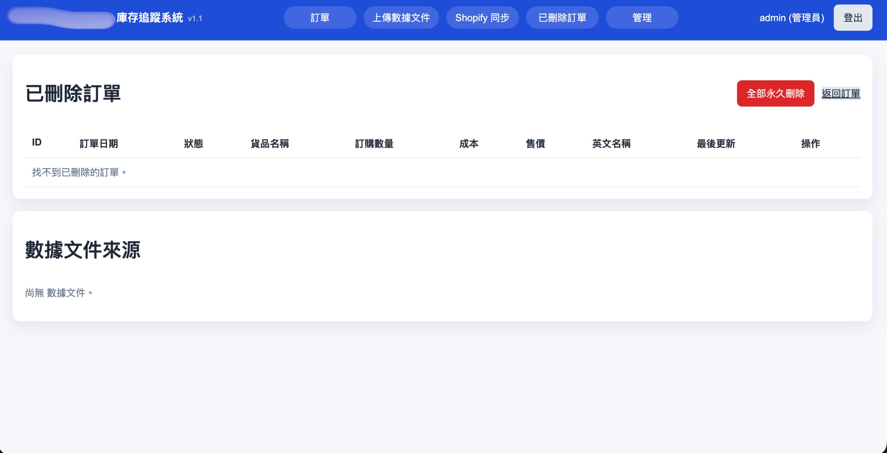

# Inventory & Order Management System

A public-safe project showcase for a private, production-used inventory application.

This repository copy is designed for portfolio review. It explains what the system does, how users move through it, and how the pieces fit together without exposing private source code, credentials, customer records, supplier details, product identifiers, business pricing, or production configuration.

## What This Project Demonstrates

This app is a browser-based inventory and order tracking system for a small team that needs one shared place to manage orders, import spreadsheet data, audit changes, recover deleted records, export reports, and prepare selected products for Shopify inventory workflows.

The original application is private because it contains company-specific configuration and operational knowledge. This public display folder contains sanitized documentation, screenshots, and diagrams that communicate the full product and engineering work at a high level.

## Sanitized Preview

The screenshots below use redacted or generic demo values. The live app UI is Chinese-language because it was built for the team using it; this public documentation is in English for recruiters and engineering reviewers.

### Orders Dashboard


The main workspace supports search, advanced filters, sorting, pagination, row selection, bulk deletion, add/edit forms, and Excel export.

### CSV / Excel Import Review


Administrators can upload CSV/XLSX files, review detected columns, edit rows before import, filter validation issues, and import only clean records.

### Shopify Sync Queue


Unsynced products are separated into actionable queues for new Shopify products, existing products that need manual review, and failed sync attempts.

### Deleted Orders & Source Cleanup



Deleted orders move through a recycle-bin workflow before permanent cleanup. Admins can also review and remove imported file sources.

### Admin User Management


Admins can create users, assign roles, and manage access from a dedicated screen.

## Core Capabilities

- Centralized order and inventory records in a shared browser interface.
- Role-based access for employee and administrator workflows.
- Order search, filters, sorting, pagination, add, edit, soft delete, restore, permanent delete, and export.
- Spreadsheet import from CSV/XLSX with automatic column detection, preview editing, validation, draft recovery, duplicate file handling, and import history.
- Audit trail for field-level order changes.
- Similar-product lookup to reduce duplicate product creation.
- Shopify sync workflow for selected inventory items, including failed-sync tracking.
- Local SQLite runtime storage with migration helpers.
- Automatic monthly spreadsheet backups.
- Waitress-based local server mode for LAN access.
- PyInstaller packaging for Windows distribution.

## Tech Stack

- Python
- Flask
- Flask-Login
- SQLAlchemy
- SQLite
- Waitress
- Pandas and OpenPyXL
- HTML, CSS, vanilla JavaScript
- PyInstaller

## Documentation Map

- [Feature Tour](./FEATURE_TOUR.md): product features and user-facing behavior.
- [Architecture](./ARCHITECTURE.md): system structure, data model, deployment model, and Mermaid diagrams.
- [Workflows](./WORKFLOWS.md): order, import, delete/restore, Shopify sync, and backup flows.
- [Case Study](./CASE_STUDY.md): problem, constraints, solution, and engineering decisions.
- [Demo Script](./DEMO_SCRIPT.md): a guided walkthrough for interviews or portfolio demos.
- [Security & Sanitization](./SECURITY_AND_SANITIZATION.md): what was removed, what to check before publishing, and why source code is excluded.

## Why Source Code Is Not Public

The private project includes implementation details tied to a real business environment, including configuration defaults, operational assumptions, and integrations. Publishing the source could expose sensitive business data or make it easier to infer private workflows.

This display package is meant to provide a complete understanding of the application through:

- Sanitized screenshots.
- System diagrams.
- Workflow diagrams.
- Feature explanations.
- Engineering case study.
- Demo talking points.
- Security notes.

## Example Local Deployment Model

The production-style setup runs on one office computer and serves the app over the local network.

```text
Office computer
  runs packaged Inventory app
  stores local SQLite database
  writes backups and logs
  serves browser UI over LAN

Employee/admin devices
  open browser URL on same network
  use role-based UI
```

The public documentation intentionally uses placeholders such as `Demo Company`, `localhost`, `192.168.x.x`, and `SHOPIFY_STORE_DOMAIN=example-store.myshopify.com`.


