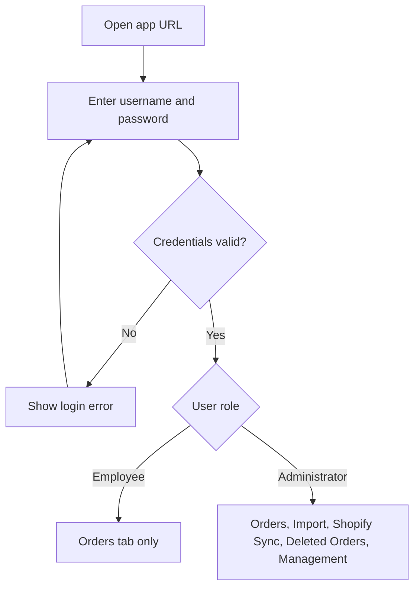
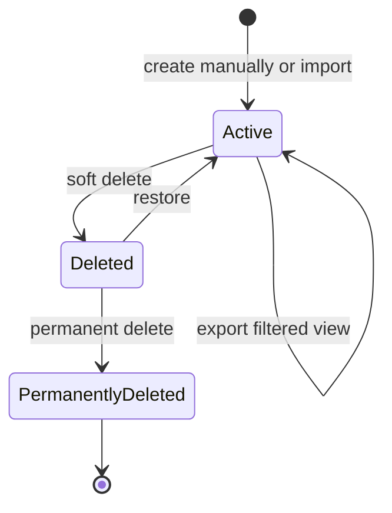
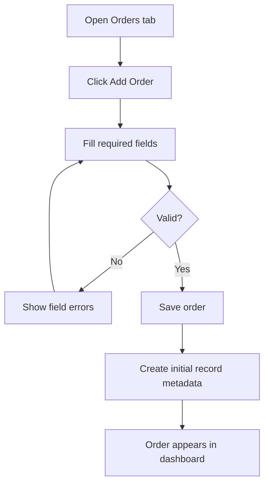
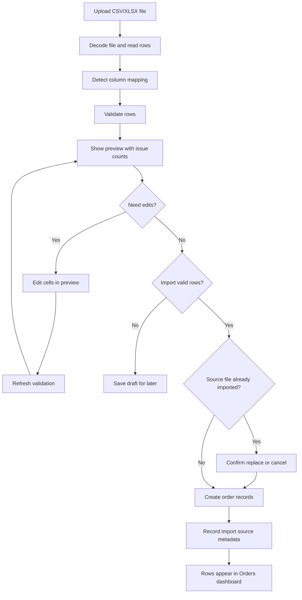
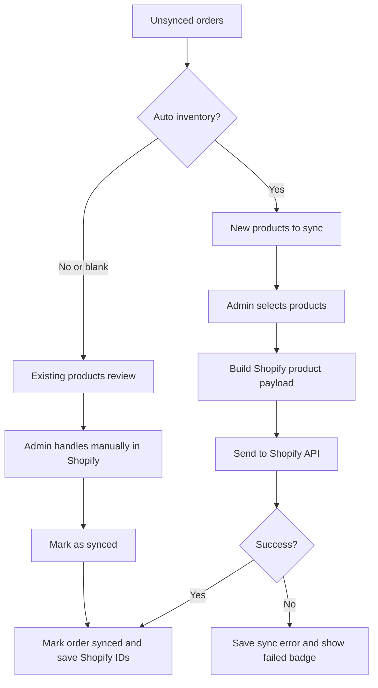
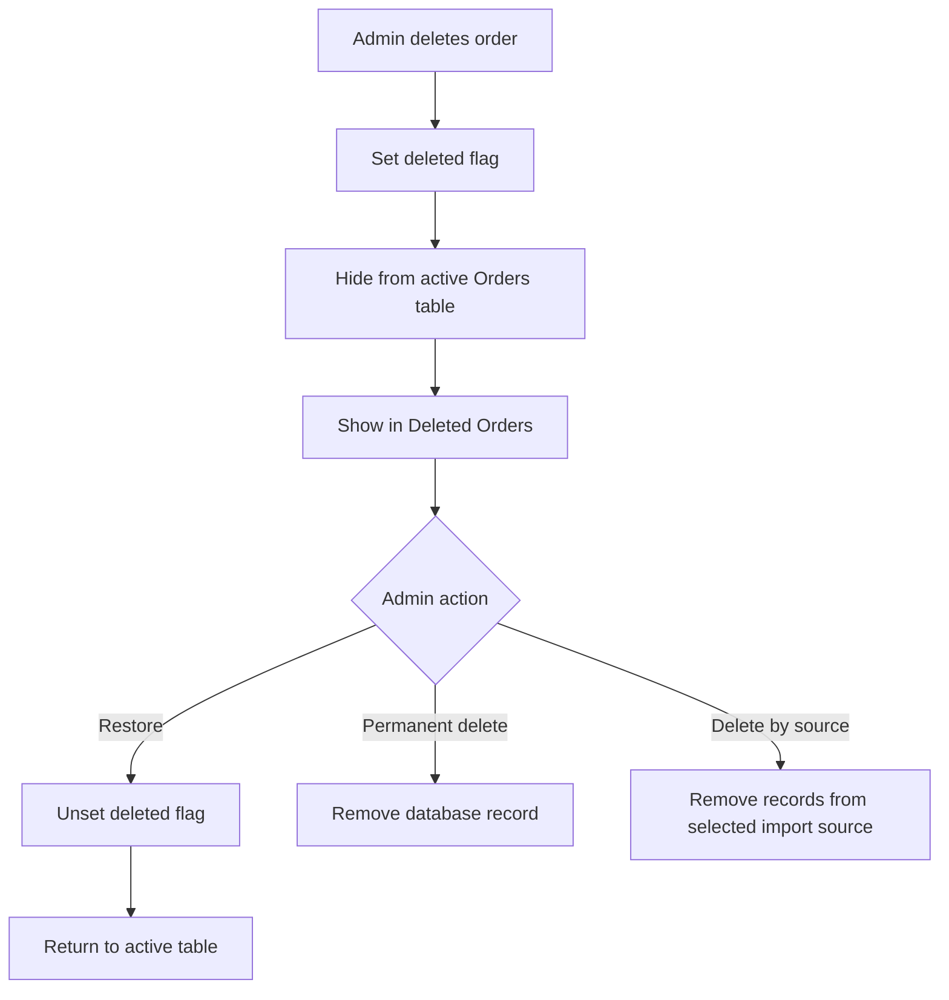
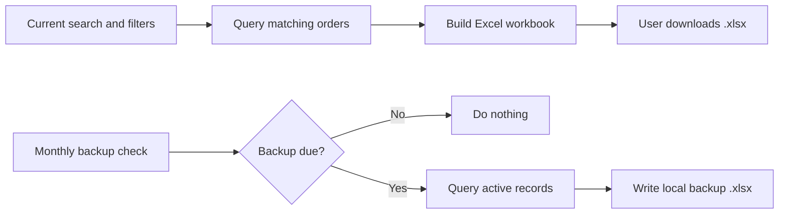
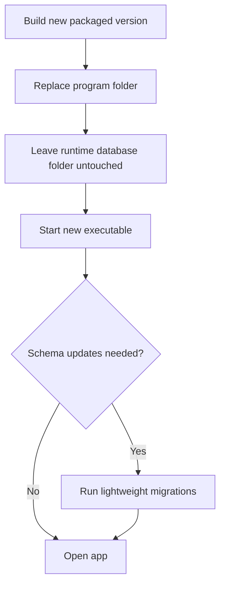

# Workflows

These diagrams show how the system behaves from a user's point of view.

## Login And Role Routing

## Order Lifecycle

## Manual Order Entry

## CSV / XLSX Import

## Shopify Sync

## Deleted Order Recovery

## Export And Backup

## Update Workflow

